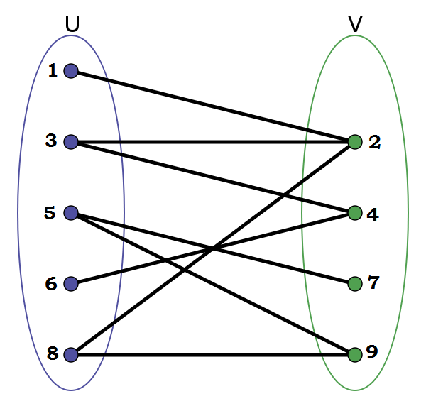

## 그래프는 '정점(Vertex)'과 그 사이를 잇는 '간선(Edge)'로 이루어진다.

### 이분 그래프

: 정점을 두 개의 분리된 집합으로 나눌 수 있는 그래프 cf)그래프 색칠 문제, 최대 매칭 문제


---

### BFS, 너비 우선 탐색

: 그래프나 트리에서 특정 노드를 시작으로 '너비'를 기준으로 차례차례 탐색하는 알고리즘

- 큐(Queue)라는 자료구조를 이용하여 탐색
- 큐는 먼저 들어온 것이 먼저 나오는 선입선출 방식으로 작동
- BFS 탐색 순서는 시작 노드에서 시작하여 같은 레벨에 있는 노드들을 차례대로 탐색하고 그 다음으로 다음 레벨의 노드들을 탐색 (A → B → C → D → E)

```mathematica
        A
       / \
      B   C
     / \
    D   E
```

1. 시작 노드를 큐에 넣기
2. 큐에서 노드를 하나씩 꺼내면서 그 노드와 연결된 인접 노드를 큐에 넣기
3. 방문한 노드는 다시 방문하지 않도록 체크
4. 큐가 비어질 때까지 반복

```JAVA
// 1)그래프의 노드 수와 간선 정의
// 그래프는 ArrayList를 사용하여 인접 리스트 방식으로 표현
int n = 6;
List<Integer>[] graph = new ArrayList[n+1];

// 2)그래프 초기화 (인접 리스트 방식)
for(int i=1; i<=6; i++){
    graph[i] = new ArrayList<>();
}

// 3)간선 추가 (그래프의 연결된 노드들)
// cf) graph[1]은 노드 1과 연결된 모든 노드를 리스트로 저장
graph[1].add(2);
graph[1].add(3);
graph[2].add(1);
graph[2].add(4);
graph[2].add(5);
graph[3].add(1);
graph[4].add(2);
graph[5].add(2);

// 4)BFS 탐색을 위한 큐와 방문 기록 배열
// 이미 방문한 노드는 큐에 넣지 않음
Queue<Integer> queue = new LinkedList<>();
boolean[] visited = new boolean[n + 1];

// 5)시작 노드를 큐에 넣고 방문 처리
queue.offer(1);
visited[1] = true;

// 6)큐가 빌 때까지 반복
while (!queue.isEmpty()) {

    // 큐에서 노드 하나 꺼내기
    int node = queue.poll();
    // 현재 노드 출력
    System.out.print(node + " ");

    // 7. 현재 노드와 연결된 모든 인접 노드를 큐에 넣기
    for (int neighbor : graph[node]) {
        if (!visited[neighbor]) { // 아직 방문하지 않은 노드라면
            visited[neighbor] = true; // 방문 처리
            queue.offer(neighbor); // 큐에 넣기
        }
    }
}
```
